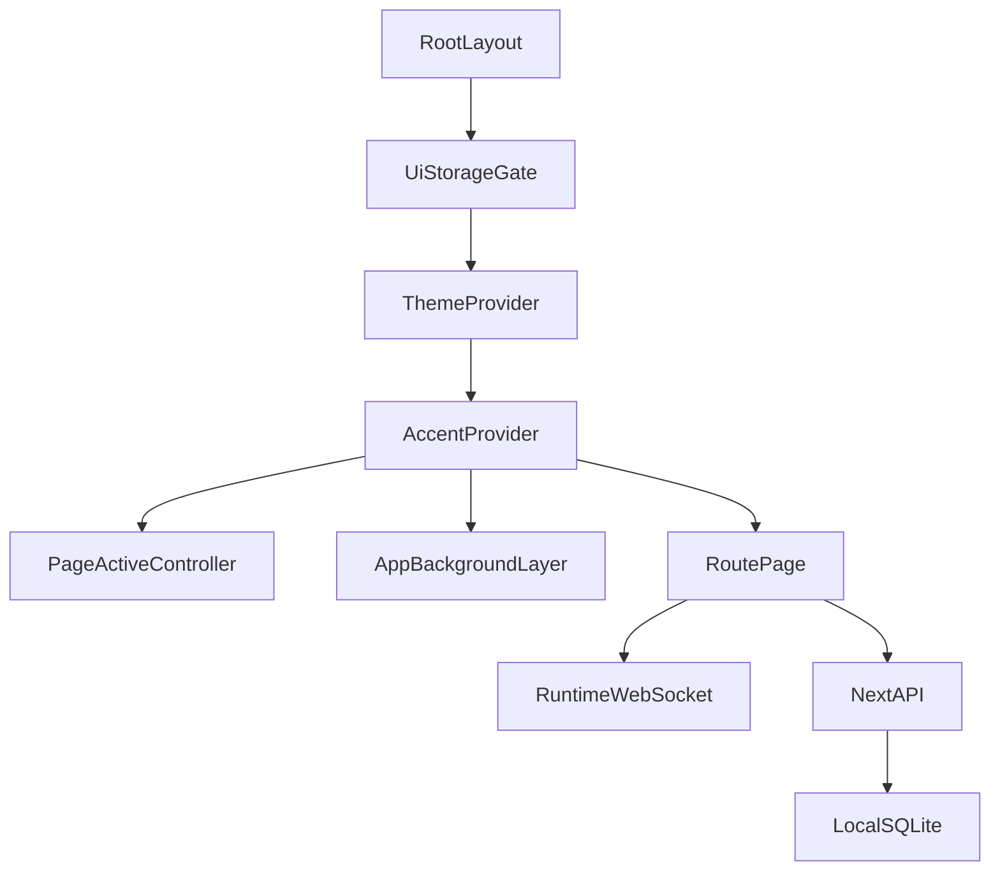

# NovaAIO Frontend Overhaul Requirements

**Status:** Active transition — Unified Deployments shipped in V.75  
**Scope:** NovaAIO HUD (`hud/`)  
**Purpose:** Define the current frontend surface, protected behavior, redesign requirements, affected files, risks, and migration order before implementation.

---

## 1. Objective

NovaAIO needs a full frontend overhaul that makes the desktop app feel like one coherent product rather than a collection of independently styled pages.

The overhaul may replace visual styling, layouts, navigation, menus, dialogs, and page composition. It must preserve working product capabilities and backend contracts unless a later product decision explicitly retires or changes them.

This document remains the frontend discovery baseline. V.75 established Deployments as the first consolidated product surface; the broader shell and design-system overhaul remains open.

### V.75 transition decision

- `/deployments` replaces separate creation flows with Simple and Advanced modes.
- Simple uses Nova's WebSocket runtime to obtain a strict plan, then validates and persists it before launch.
- Advanced combines the configured-provider task form with the existing guided Mission builder and graph canvas.
- Existing Agent Task and Mission lists remain visible during migration; their execution engines are compatibility backends behind canonical Deployment runs.
- Provider/model selectors show only configured providers and are validated again on the server.
- Mission agent graph nodes are described as routing metadata until they invoke the real specialist runtime.

## 2. Desired Outcomes

The finished frontend should:

- Present one consistent, Electron-aware application shell on every route.
- Make all primary capabilities discoverable through clear global navigation.
- Use a documented design system rather than page-local class collections.
- Use shared, accessible primitives for buttons, fields, menus, dialogs, sheets, tooltips, toasts, loading states, and empty states.
- Preserve realtime chat, agent task, mission, calendar, integration, analytics, and trading behavior.
- Work cleanly from the supported minimum of 1024×768 through 4K.
- Preserve user theme, accent, orb, font-size, background, and accessibility preferences.
- Reduce duplicated page shells, settings instances, conversation controls, theme helpers, and overlay implementations.
- Introduce enough automated coverage to allow pages to be migrated safely.

## 3. Non-Goals for the Discovery Stage

- Implementing the new UI.
- Selecting final colors, typography, spacing, or motion.
- Replacing backend APIs or storage.
- Changing mission graph schemas.
- Changing WebSocket, SSE, OAuth, or Electron IPC protocols.
- Removing product capabilities without an explicit decision.

## 4. Platform and Technical Constraints

| Constraint | Requirement |
| --- | --- |
| Desktop runtime | Preserve the frameless Electron window and `window.electronAPI` contracts. |
| Minimum viewport | Support 1024×768 without clipped primary actions or inaccessible content. |
| Large displays | Scale intentionally through 1920×1080 and 4K; do not rely only on global root-font scaling. |
| Next.js | Remain compatible with Next.js 16 App Router and React 19 client boundaries. |
| Styling | Work with Tailwind CSS 4's CSS-first configuration. |
| Theme startup | Preserve pre-paint theme bootstrap and SQLite-mirrored UI-storage hydration. |
| Local-first behavior | Keep all UI calls same-origin and compatible with the local request guard. |
| Realtime | Preserve runtime WebSocket, agent-task SSE, mission HTTP streaming, and Polymarket WebSocket behavior. |
| Security | Never expose unmasked integration secrets; keep OAuth callback paths stable. |
| Packaging | Keep packaged production routes and Electron startup behavior working. |

---

## 5. Current Application Architecture

The root layout is defined in `hud/app/layout.tsx` and currently composes:

1. Theme bootstrap script.
2. `UiStorageGate`.
3. `ThemeProvider`.
4. `AccentProvider`.
5. `PageActiveController`.
6. `AppBackgroundLayer`.
7. The active route.

There is no shared React application shell that owns navigation, title-bar behavior, settings, overlays, or toasts. Most pages build their own header and shell.

### 5.1 Current global systems

| System | Primary files | Preserve |
| --- | --- | --- |
| Theme | `hud/lib/context/theme-context/index.tsx` | Dark/light/system resolution, font scale, setting events. |
| Accent | `hud/lib/context/accent-context/index.tsx` | Accent and spotlight CSS-variable contracts. |
| UI storage | `hud/components/settings/ui-storage-gate.tsx`, `hud/lib/settings/ui-storage/` | Hydration order, pending writes, SQLite mirror. |
| Background | `hud/components/background/app-background-layer.tsx` | User-selected image/video/background behavior. |
| Inactive-page throttling | `hud/components/background/page-active-controller.tsx` | Animation pause behavior. |
| Runtime state | `hud/lib/chat/hooks/useNovaState.ts` | WebSocket messages, send/ack/stream behavior, voice state. |
| Electron APIs | `hud/electron/preload.js`, `hud/global.d.ts` | Window controls, notifications, auto-launch, file drop. |

---

## 6. Route Inventory

NovaAIO currently has 11 user-facing surfaces plus the root redirect.

| Route | Purpose | Primary implementation | Redesign impact |
| --- | --- | --- | --- |
| `/` | Clears the active conversation and redirects to Home. | `hud/app/page.tsx` | Low; decide whether this redirect behavior remains necessary. |
| `/home` | Main dashboard and command center. | `hud/app/home/` | Critical; highest visual and behavioral density. |
| `/chat` | Full conversation experience. | `hud/app/chat/`, `hud/components/chat/` | Critical; realtime and persistence-sensitive. |
| `/deployments` | Unified Simple manager and Advanced task/automation creation, activity, review, and launch. | `hud/app/deployments/`, `hud/components/deployments/` | Critical; canonical entry point for agentic work. |
| `/missions` | Mission list, creation, execution, and workflow editing. | `hud/app/missions/` | Critical; large state orchestrator and modal canvas. |
| `/missions/calendar` | Combined mission, task, and personal calendar. | `hud/app/missions/calendar/page.tsx` | High; monolithic page and rescheduling behavior. |
| `/integrations` | Provider and service configuration. | `hud/app/integrations/` | High; many forms, secrets, OAuth, and setup states. |
| `/analytics` | LLM usage, cost, cache, routing, and budget analytics. | `hud/app/analytics/page.tsx` | Medium; monolithic page and charts. |
| `/polymarket` | Markets, charts, wallet, portfolio, and trading. | `hud/app/polymarket/` | High; realtime and transaction-sensitive. |
| `/dev-logs` | Runtime-turn inspection and diagnostics. | `hud/app/dev-logs/` | Low to medium. |
| `/history` | Legacy standalone conversation history. | `hud/app/history/page.tsx` | Decision required; orphaned and uses divergent persistence. |

### 6.1 Missing or questionable routes

- `/login` is referenced by integration and settings code but no page exists. Authentication is currently local-only. All `/login` navigation must be removed, redirected, or backed by a deliberate route.
- `/history` has no discovered in-app entry point. It reads localStorage-only conversations while Home and Chat use SQLite-backed `/api/threads`.
- `/` is only a client redirect. Some “Home” actions route through `/` instead of `/home`.

---

## 7. Per-Page Requirements

### 7.1 Home

**Current responsibilities**

- Global-feeling header, orb, connection state, Settings, and Electron window controls.
- Conversation history and archived threads.
- Home command/chat surface.
- Calendar briefing.
- Spotify, YouTube, Polymarket, weather, crypto, and notes modules.
- Agent tasks and analytics summaries.
- Integration status and agent organization shortcuts.

**Primary files**

- `hud/app/home/components/home-main-screen.tsx`
- `hud/app/home/hooks/use-home-main-screen-state.ts`
- `hud/app/home/hooks/use-home-visuals.ts`
- `hud/app/home/components/*-home-module.tsx`

**Requirements**

- Separate global shell responsibilities from dashboard content.
- Make dashboard modules configurable without coupling navigation to one monolith.
- Preserve conversation, media, notes, task, schedule, analytics, and market actions.
- Preserve the 1024×768 information-density requirement without unreadably small controls.
- Replace duplicated conversation UI with the same shared conversation components used by Chat.
- Define module loading, error, empty, stale, and disconnected states.

### 7.2 Chat

**Current responsibilities**

- Thread list and lifecycle actions.
- Streaming assistant messages and tool-related states.
- Composer, attachments, voice mute, and runtime interruption.
- Mission and integration shortcuts.
- Gmail summary intent.

**Primary files**

- `hud/app/chat/components/chat-shell-controller.tsx`
- `hud/app/chat/components/message-list.tsx`
- `hud/app/chat/components/message-bubble.tsx`
- `hud/components/chat/chat-sidebar.tsx`
- `hud/components/chat/composer.tsx`
- `hud/lib/chat/hooks/useConversations.ts`
- `hud/lib/chat/hooks/useNovaState.ts`

**Requirements**

- Preserve WebSocket payloads, acknowledgement tokens, streaming merge behavior, and interruption.
- Preserve optimistic thread creation and SQLite-backed thread synchronization.
- Make thread navigation collapsible and usable at all supported sizes.
- Keep the composer and current conversation visible during streaming.
- Define consistent rendering for assistant text, code, tools, mission output, errors, and attachments.
- Do not replace runtime chat with `/api/chat`; the active HUD transport is WebSocket.

### 7.3 Missions

**Current responsibilities**

- Mission search, filtering, templates, creation, duplication, deletion, and activation.
- Natural-language mission generation.
- Run-now behavior, progress, queue metrics, reliability, versions, and autofix.
- React Flow workflow editing.

**Primary files**

- `hud/app/missions/page.tsx`
- `hud/app/missions/hooks/use-missions-page-state.ts`
- `hud/app/missions/api.ts`
- `hud/app/missions/components/`
- `hud/app/missions/canvas/`

**Requirements**

- Preserve mission/node persisted schemas and handle semantics.
- Preserve build, trigger, streaming progress, version, reliability, and autofix APIs.
- Separate list, builder, canvas, and run-progress concerns.
- Replace manual action menus and dialogs with shared accessible primitives.
- Treat the canvas as an expert workspace with keyboard, zoom, navigation, validation, and unsaved-change states.
- Migrate this surface after lower-risk pages establish stable primitives.

### 7.4 Mission Calendar

**Current responsibilities**

- Day, week, and month views.
- Personal events, mission schedules, and agent tasks.
- Mission rescheduling and override removal.
- Event details and mission editing handoff.

**Primary files**

- `hud/app/missions/calendar/page.tsx`
- `hud/lib/calendar/useCalendarEvents/index.ts`

**Requirements**

- Preserve category preferences and calendar WebSocket refresh behavior.
- Preserve reschedule and override APIs.
- Extract the monolithic calendar into view, toolbar, event, details, and data-controller components.
- Provide clear event-source, conflict, loading, empty, and failure states.

### 7.5 Integrations

**Current responsibilities**

- LLM provider setup.
- OAuth service connection.
- Messaging, market, wallet, search, media, and voice configuration.
- Connection testing, model listing, secret inputs, and disconnect actions.

**Primary files**

- `hud/app/integrations/page.tsx`
- `hud/app/integrations/modules/components/integrations-main-panel.tsx`
- `hud/app/integrations/hooks/`
- `hud/app/integrations/components/`
- `hud/lib/integrations/store/client-store.ts`

**Requirements**

- Preserve `?setup=` deep links.
- Preserve masked-secret behavior and configured-state indicators.
- Preserve OAuth connect/callback/disconnect URLs.
- Standardize setup pages around shared form, validation, save, test, and status primitives.
- Make keyboard focus and error recovery explicit.
- Distinguish local unsaved fields, cached status, authoritative server status, and active runtime status.

### 7.6 Analytics

**Current responsibilities**

- LLM usage, token, cost, source, model, provider, cache, and routing-tier reporting.
- Agent-task budget and event reporting.
- Time-range selection and refresh.

**Primary files**

- `hud/app/analytics/page.tsx`
- `hud/lib/analytics/types.ts`
- `hud/app/home/components/analytics-home-module.tsx`

**Requirements**

- Preserve `days`, timezone, and `#budgets` contracts.
- Use shared metric, chart, table, loading, and empty-state components.
- Ensure charts remain legible without relying only on color.
- Align the page with the selected design system rather than a separate hardcoded indigo theme.

### 7.7 Polymarket

**Current responsibilities**

- Market search, filters, sorting, detail, history, order book, leaderboard, and portfolio.
- Wallet connection and trading controls.
- Realtime market updates.

**Primary files**

- `hud/app/polymarket/page.tsx`
- `hud/app/polymarket/components/`
- `hud/lib/integrations/polymarket/ws.ts`

**Requirements**

- Preserve query deep links (`slug`, `outcome`, `side`).
- Preserve wallet configuration and transaction safeguards.
- Clearly separate informational, connected, ready-to-trade, pending, success, and failed states.
- Keep price, order-book, and position information readable at minimum resolution.
- Treat trading actions as high-risk confirmations, not generic buttons.

### 7.8 Dev Logs

**Current responsibilities**

- Runtime turn metrics, search, filtering, expansion, copying, and raw JSON.

**Primary files**

- `hud/app/dev-logs/components/dev-logs-screen.tsx`
- `hud/app/dev-logs/hooks/use-dev-logs-data.ts`

**Requirements**

- Use the shared shell, filters, tables, status badges, and detail panels.
- Preserve high-density diagnostic information and copy behavior.

### 7.9 History

**Current responsibilities**

- Displays localStorage-only previous conversations.

**Decision required**

Choose one:

1. Remove the route and expose history through the shared Chat navigation.
2. Rebuild it as an SQLite-backed full history/search surface.

The current split persistence must not remain.

---

## 8. Navigation and Application Shell

### 8.1 Current issues

- No unified global shell.
- Eight or more pages repeat the orb/title/presence header.
- Electron window controls and drag region appear only on Home.
- Chat has a fixed sidebar; Home has a separate conversation-history implementation.
- There is no global command palette.
- There is no responsive navigation model beyond stacking and hiding panels.
- Settings is mounted independently in seven locations.
- Secondary routes such as Analytics and Dev Logs are easy to miss.

### 8.2 Required shell capabilities

The future shell must provide:

- Electron drag region and window controls on every applicable route.
- Persistent product identity and runtime connection state.
- Primary navigation to Home, Chat, Missions, Calendar, Integrations, Analytics, and relevant tools.
- Optional collapsible left navigation.
- Optional contextual right inspector.
- One Settings host.
- One dialog/overlay host.
- One toast/notification host.
- Route title, breadcrumbs, and contextual actions.
- Keyboard navigation and visible focus.
- A deliberate 1024×768 compact mode.
- A deliberate large-screen mode that limits line length and avoids oversized empty regions.

### 8.3 Candidate navigation model

The final model remains a design decision. The recommended baseline is:

- Persistent collapsible left rail for global destinations.
- Shared top title bar for Electron controls and page actions.
- Contextual secondary navigation inside complex workspaces.
- Optional command palette for route and action discovery.

---

## 9. Overlay, Menu, and Feedback Inventory

### 9.1 Existing overlay types

| Type | Current implementation examples |
| --- | --- |
| Settings dialog | `hud/components/settings/settings-modal.tsx` |
| Avatar crop | Nested in Settings |
| New deployment (Simple + Advanced task/automation) | `hud/app/deployments/components/new-deployment-modal.tsx` (task form: `hud/components/agents/advanced-task-form.tsx`) |
| Mission builder | `hud/app/missions/components/mission-builder-modal.tsx` |
| Mission canvas | `hud/app/missions/components/mission-canvas-modal.tsx` |
| Delete mission | `hud/app/missions/components/delete-mission-dialog.tsx` |
| Event details | Home schedule and mission calendar |
| YouTube detail | Home module portal |
| Polymarket inspection | Home module portal |
| Run progress | Fixed floating panel |
| Conversation menus | Shared Radix dropdown and duplicated Home menu |
| Mission action menu | Manual fixed-position menu |
| Select menus | Custom `FluidSelect` portal |
| Toasts | Separate implementations in Integrations, Missions, Polymarket, and Chat |

### 9.2 Current risks

- Ad hoc z-index values range roughly from 40 to 140.
- Most custom dialogs lack focus traps.
- Escape behavior is inconsistent.
- Dialog roles and accessible names are inconsistent.
- Backdrop clicks do not follow one policy.
- Toasts are not managed as a queue and generally lack live-region behavior.
- Tooltip behavior relies mostly on native `title`.
- A pointer-events cleanup loop compensates for stale overlay locks.

### 9.3 Required primitives

Create shared primitives for:

- Dialog.
- Alert dialog.
- Sheet/drawer.
- Dropdown/context menu.
- Popover.
- Select/combobox.
- Tooltip.
- Toast and persistent banner.
- Command palette.
- Loading overlay.

Every overlay primitive must define:

- Focus entry, containment, and restoration.
- Escape and backdrop behavior.
- Accessible title and description.
- Scroll locking.
- Portal and stacking behavior.
- Nested overlay behavior.
- Reduced-motion behavior.

---

## 10. Design System Requirements

### 10.1 Current state

The current aesthetic is recognizable but implemented through multiple overlapping systems:

- shadcn-style OKLCH semantic tokens.
- Nova `--s` opacity tokens.
- Runtime accent and orb CSS variables.
- Repeated hardcoded light-mode hex values.
- Raw Tailwind slate colors.
- Page-local `panelClass`, `subPanelClass`, and `isLight` branches.
- Two spotlight class systems.
- Minimal shared UI components.

The existing `hud/components/ui/` directory contains only:

- `button.tsx`
- `dropdown-menu.tsx`
- `fluid-select.tsx`
- `nova-switch.tsx`

### 10.2 Required token categories

Define and document:

- Semantic colors: canvas, surface, elevated surface, text, muted text, border, accent, success, warning, danger, information.
- User-selectable accent and orb relationships.
- Typography families, sizes, weights, line heights, and density modes.
- Spacing scale.
- Radius scale.
- Border and divider rules.
- Elevation and shadow scale.
- Overlay z-index scale.
- Motion durations, easing, and reduced-motion alternatives.
- Responsive breakpoints and content maximums.
- Data-visualization palette with color-vision considerations.

### 10.3 Required component families

- Application shell, header, navigation rail, breadcrumb, and page toolbar.
- Button and icon button.
- Input, textarea, secret input, search, number, date, and time fields.
- Checkbox, radio, switch, select, combobox, slider, and segmented control.
- Tabs and disclosure.
- Card, panel, metric card, and status badge.
- Table, list, virtualized feed, and pagination.
- Dialog, sheet, menu, popover, tooltip, and toast.
- Empty, loading, error, disconnected, and permission states.
- Chart frame, legend, tooltip, and no-data state.
- Form field, validation message, and save-status indicator.
- Conversation list, message, composer, and streaming indicator.

### 10.4 Identity decision

A later design stage must decide whether to:

1. Preserve and systematize the current glass/orb identity.
2. Evolve it into a new Nova visual language.
3. Replace it using supplied product references.

The system architecture should support any of these without changing feature behavior.

---

## 11. Accessibility Requirements

The overhaul must meet the following baseline:

- Full keyboard access for navigation, forms, menus, dialogs, canvas controls, and primary actions.
- Visible focus that is not removed by custom styling.
- Focus trapping and restoration for modal interfaces.
- Semantic landmarks, headings, labels, buttons, tables, and status regions.
- Accessible names for icon-only controls.
- Live announcements for toasts, connection changes, saves, errors, and long-running actions.
- No status communicated by color alone.
- Sufficient contrast in both light and dark themes.
- Reduced-motion support for orb, spotlight, streaming, and transition effects.
- Browser zoom must not be intentionally disabled without a documented desktop-specific reason.
- Loading gates must expose an accessible status instead of a silent blank screen.

---

## 12. Responsive and Desktop Requirements

### 12.1 Supported layouts

| Viewport | Expected behavior |
| --- | --- |
| 1024×768 | Compact shell, all primary actions reachable, no essential clipped panels. |
| 1280–1600 wide | Standard desktop layout. |
| 1920×1080 | Primary design target with balanced density. |
| 2560 wide and 4K | Controlled content widths, optional inspectors, intentional scaling. |

### 12.2 Rules

- Do not assume three columns fit below the defined breakpoint.
- Avoid hiding important actions solely because the viewport is below `xl`.
- Replace fixed viewport heights that trap content with resilient scrolling regions.
- Use container queries only when component behavior is documented.
- Test Windows display scaling as well as CSS viewport dimensions.
- Keep Electron title-bar actions reachable and non-overlapping.

---

## 13. Protected Behavioral Contracts

The redesign must preserve these contracts unless separately migrated and tested.

### 13.1 Runtime WebSocket

`hud/lib/chat/hooks/useNovaState.ts` handles:

- Runtime state.
- Thinking state.
- Message acknowledgement.
- Assistant stream start/delta/end.
- Final messages and transcripts.
- Agent-task budget events.
- YouTube home events.
- Calendar events.
- Voice and mute commands.

Multiple pages currently instantiate this hook. A shared runtime provider is desirable, but it must preserve message ordering, reconnect behavior, user scoping, and side-channel events.

### 13.2 Agent task SSE

Preserve:

- Snapshot/upsert ordering.
- Fallback polling.
- Task status and action rules.
- Budget-state merges from SSE and WebSocket events.
- Maximum concurrency behavior.
- Create-task file-drop support in Electron.

### 13.3 Thread persistence

Preserve:

- Optimistic IDs.
- Streaming merge and debounce behavior.
- Rename, archive, pin, and delete actions.
- `/api/threads` and message endpoints.

Retire the localStorage-only `/history` behavior.

### 13.4 UI-storage mirror

Preserve:

- Allowed key prefixes.
- Pending local write reconciliation.
- Active-user scoping.
- Theme bootstrap key alignment.
- Persistence through packaged app origin/port changes.

### 13.5 Missions

Preserve:

- Mission and node schemas.
- React Flow node IDs, edges, handles, and configuration.
- Trigger-stream event behavior.
- Versions, reliability, autofix, and scheduling.

### 13.6 Integrations

Preserve:

- Masked secret fields.
- Configured flags and hints.
- OAuth callback paths.
- Service test and model-list behavior.
- Deep links to setup keys.

### 13.7 Electron

Preserve:

- Minimize, maximize, close, and maximize-state behavior.
- Drag regions and interactive no-drag regions.
- Native notifications.
- Auto-launch settings.
- File drop and path resolution.

---

## 14. Touch and Preserve Matrix

### 14.1 Expected high-touch areas

| Area | Files |
| --- | --- |
| Global styles and tokens | `hud/app/globals.css`, `hud/app/styles/*.css` |
| Root shell | `hud/app/layout.tsx`, new shared shell components |
| Home | `hud/app/home/` |
| Chat | `hud/app/chat/`, `hud/components/chat/` |
| Settings | `hud/components/settings/` |
| Missions | `hud/app/missions/` |
| Integrations | `hud/app/integrations/` |
| Calendar | `hud/app/missions/calendar/page.tsx` |
| Analytics | `hud/app/analytics/page.tsx` |
| Polymarket | `hud/app/polymarket/` |
| Agent tasks | `hud/components/agents/`, `hud/app/home/components/agent-tasks-home-module.tsx` |
| Dev logs | `hud/app/dev-logs/` |
| Shared primitives | `hud/components/ui/` |
| Background and chrome | `hud/components/background/`, `hud/components/window/` |

### 14.2 Preserve-first areas

| Area | Files or contract |
| --- | --- |
| Theme behavior | `hud/lib/context/theme-context/index.tsx` |
| Accent behavior | `hud/lib/context/accent-context/index.tsx` |
| User setting shape | `hud/lib/settings/userSettings/index.ts` |
| UI-storage behavior | `hud/lib/settings/ui-storage/` |
| Runtime protocol | `hud/lib/chat/hooks/useNovaState.ts` |
| Thread behavior | `hud/lib/chat/hooks/useConversations.ts` and `/api/threads` |
| Mission data model | Mission types, APIs, and persisted React Flow schema |
| Integration security | Client/server config stores and masked-secret API behavior |
| Electron IPC | `hud/electron/preload.js`, `hud/global.d.ts` |
| API routes | `hud/app/api/` unless a separately planned migration requires changes |

---

## 15. Cleanup Candidates

These are candidates, not automatic removals:

- Remove or rebuild `/history`.
- Resolve all `/login` references.
- Route Home actions directly to `/home` instead of through `/`.
- Replace seven independent Settings mounts with one host.
- Merge Home conversation history with shared Chat navigation.
- Replace repeated page headers with the shared shell.
- Replace manual mission menus with shared menu primitives.
- Replace page-local toasts with one host.
- Remove ad hoc z-index values.
- Consolidate repeated color-conversion helpers.
- Consolidate background and panel theme helpers.
- Remove or intentionally adopt unused `hud/components/effects/` components.
- Remove unused Home command, replay-boot, and sidebar API paths after verification.

---

## 16. Testing Requirements

Current browser coverage is too narrow for a safe full redesign. Before high-risk migrations, add coverage for:

### 16.1 Application shell

- Every route loads inside the shared shell.
- Navigation works at 1024×768 and 1920×1080.
- Electron controls render only when available and remain clickable.
- Theme and accent hydrate without a wrong-theme flash.

### 16.2 Chat

- Create/select/rename/archive/pin/delete a thread.
- Send a message and render stream start/delta/end.
- Interrupt a response.
- Preserve composer state and attachment behavior.

### 16.3 Settings

- Open from any route.
- Navigate sections.
- Save appearance settings and reload.
- Validate secrets are never returned unmasked.
- Verify nested dialogs and keyboard focus.

### 16.4 Agent tasks

- Preserve existing task smoke coverage.
- Add create, pause, resume, stop, delete, budget warning, and file-drop coverage.

### 16.5 Missions and calendar

- Mission list load and filtering.
- Create/edit/save/delete.
- Canvas load and persisted node configuration.
- Run progress stream.
- Calendar view switching and rescheduling.

### 16.6 Integrations and markets

- Setup deep links.
- Save/test/disconnect states.
- OAuth start and callback handling with mocked providers.
- Polymarket disconnected, connected, pending-trade, success, and error states.

### 16.7 Visual regression

Add stable screenshots for:

- Shared shell in light and dark themes.
- Home, Chat, Missions, Integrations, Analytics, and Settings.
- 1024×768 and 1920×1080.
- Critical modal and error states.

---

## 17. Risk Register

| Risk | Severity | Mitigation |
| --- | --- | --- |
| Multiple `useNovaState` instances create duplicate connections or inconsistent state. | Critical | Introduce and test one runtime gateway before broad shell migration. |
| Home combines layout, navigation, modules, and state. | Critical | Extract contracts and module boundaries before restyling. |
| Mission state and canvas embed business logic in UI. | Critical | Migrate last; preserve schemas and add E2E coverage first. |
| Thread history has two persistence models. | High | Standardize on `/api/threads` before navigation redesign. |
| Integration UI mixes cache and authoritative server config. | High | Model explicit loading/synced/dirty/error states. |
| Ad hoc overlays have stacking and focus problems. | High | Establish one overlay system before page migrations. |
| UI-storage changes can break packaged persistence. | High | Keep key allowlists and mirror tests intact. |
| Frameless Electron chrome is not globally owned. | High | Make title-bar behavior part of the shared shell contract. |
| Minimal browser coverage permits visual regressions. | High | Establish route, shell, and critical-flow tests first. |
| Hardcoded colors and page-local theme branches cause drift. | Medium | Centralize semantic tokens before visual migration. |

---

## 18. Recommended Migration Stages

### Stage 0 — Discovery and target definition

- Approve this current-state inventory.
- Select the target visual direction.
- Decide route and navigation freedom.
- Decide the future of `/history` and `/login`.
- Produce approved wireframes for the shell and representative page types.

### Stage 1 — Regression baseline

- Add critical Playwright flows and visual baselines.
- Capture current API, WebSocket, SSE, storage, and Electron contracts.
- Record minimum-resolution failures before changing layout.

### Stage 2 — Foundations

- Create semantic tokens.
- Create shared primitives.
- Create the overlay, toast, and tooltip hosts.
- Define z-index, focus, motion, and responsive policies.
- Introduce a single runtime-state gateway if testing confirms safe parity.

### Stage 3 — Shared application shell

- Add the Electron-aware title bar.
- Add global navigation and route metadata.
- Centralize Settings.
- Add optional contextual side panels.
- Migrate pages without changing their internal feature content.

### Stage 4 — Lower-risk surfaces

- Dev Logs.
- Analytics.
- Calendar shell and static structure.

Use these pages to validate tables, charts, filters, cards, details, and responsive behavior.

### Stage 5 — Core communication

- Unify conversation navigation.
- Migrate Chat.
- Rebuild Home around a module registry and shared shell.
- Remove or rebuild `/history`.

### Stage 6 — Configuration and markets

- Migrate Integrations using shared form patterns.
- Migrate Polymarket with transaction-specific safeguards.

### Stage 7 — Missions

- Migrate mission listing and builder.
- Migrate run progress.
- Migrate React Flow canvas and node configuration.
- Verify persisted workflows created before the overhaul still load and save.

### Stage 8 — Cleanup and hardening

- Remove obsolete shell code, duplicated theme helpers, unused effects, and legacy overlays.
- Run production build, smoke tests, route sweep, and packaged Electron verification.
- Complete keyboard, contrast, reduced-motion, 1024×768, and 4K checks.

---

## 19. Acceptance Criteria

The overhaul is complete only when:

- Every current capability has an approved replacement or an explicit retirement decision.
- Every route uses the shared application shell.
- Electron controls and drag behavior work on all routes.
- All primary navigation is discoverable and keyboard accessible.
- Settings has one host and works from every route.
- Shared overlays correctly manage focus, Escape, scroll lock, and stacking.
- Home and Chat use one conversation data model.
- Theme, accent, orb, background, and font preferences survive restart.
- Chat streaming, tasks, missions, calendar, integrations, analytics, and Polymarket preserve behavior.
- No raw secret is exposed to the client.
- Layouts pass at 1024×768, 1920×1080, and 4K.
- Critical flows have automated browser coverage.
- Production build, production route smoke tests, and packaged boot verification pass.

---

## 20. Decisions Required Before Visual Implementation

1. May navigation and route structure change while capabilities remain?
2. Should the current glass/orb identity be preserved, evolved, or replaced?
3. Should Home remain a dense command center or become a simpler launch dashboard?
4. Should `/history` be removed or rebuilt?
5. Should Settings remain an overlay or become a dedicated route/workspace?
6. Should the app have a command palette?
7. Which modules are mandatory on Home, and which should be configurable?
8. Should Mission Canvas remain a modal or become its own route?
9. Which screenshots or products define the desired quality bar?

These decisions should be resolved during design, before page implementation begins.
